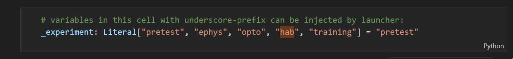
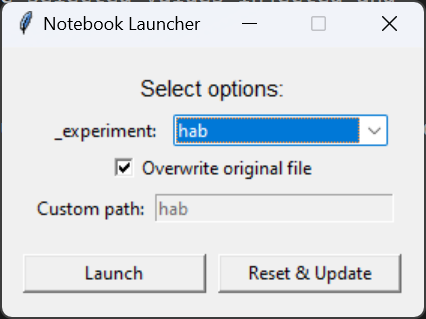
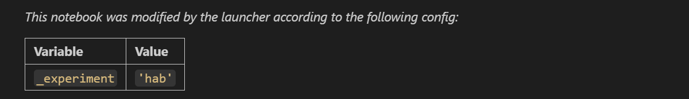

# np-notebooks-launcher

A GUI tool for launching JupyterLab with a filtered, pre-configured version of a Jupyter notebook. Designed for experiment workflows that use the same notebook across different experiment types (e.g. `ephys`, `hab`, `training`).

[](https://pypi.org/project/np-notebooks-launcher/)
[](https://pypi.org/project/np-notebooks-launcher/)

[](https://app.codecov.io/github/AllenNeuralDynamics/np-notebooks-launcher)
[](https://github.com/AllenNeuralDynamics/np-notebooks-launcher/actions/workflows/publish.yaml)
[](https://github.com/AllenNeuralDynamics/np-notebooks-launcher/issues)


## What it does

1. **Reads the first cell** of a notebook to find `_`-prefixed variables annotated as `Literal`, `int`, `float` or `bool` types — these are the configurable parameters:

    

2. **Shows a GUI** with a dropdown for each variable, pre-populated with the options and default from the notebook:

    
3. **Generates a filtered copy** of the notebook with the selected values injected and irrelevant cells removed.
4. **Launches JupyterLab** with the filtered copy, with the first cell modified:

    

The launcher also has a **Reset & Update** button which is hard-coded to reset to the latest commit on `github.com/alleninstitute/np_notebooks:main` and runs `uv sync` on the repository.

## Usage

```bash
uvx np-notebook-launcher path/to/notebook.ipynb
```

## How to annotate a notebook

### First cell — configurable variables

The first cell of the notebook is special. Any `_`-prefixed variable with a `Literal` type annotation will appear as a dropdown in the launcher GUI:

```python
# variables in this cell with underscore-prefix can be injected by launcher:
_experiment: Literal["pretest", "ephys", "opto", "hab", "training"] = "pretest"
```

- The variable name must start with `_`
- The type annotation must be `Literal[opt1, opt2, ...]`
- A default value must be assigned (`= "pretest"`)
- Supported value types: `str`, `bool`, `int`, `float`

When launched, the first cell is replaced with a markdown summary of the injected values.

### Cell directives — conditional visibility

Add a directive comment as the **first line** of any cell to control whether it appears in the filtered notebook.

**Code cells:**
```python
# /// show-if: _experiment=ephys
```

**Markdown cells:**
```markdown
<!-- /// show-if: _experiment=ephys -->
```

#### Directives

| Directive | Behavior |
|---|---|
| `show-if: <condition>` | Cell is included only when condition is true |
| `hide-if: <condition>` | Cell is hidden only when condition is true |

Cells with no directive are always included.

#### Condition syntax

Conditions use `and`, `or`, `not`, and names matching the possible option values of the variable.
The namespace prefix (e.g. `_experiment=`) is informational — what follows `=` is the boolean expression.

```python
# /// show-if: _experiment=ephys
# /// show-if: _experiment=(ephys or opto) and not pretest
# /// hide-if: _experiment=training
```

For a string variable like `_experiment = "ephys"`, the condition context is `{"ephys": True, "pretest": False, "hab": False, ...}` — each option is a key and only the selected one is `True`. Unknown names evaluate to `False`.

## Project structure

```
src/np_notebooks_launcher/__init__.py   # all logic: parsing, filtering, GUI, CLI
notebooks/dynamic_routing.ipynb         # example annotated notebook
tests/test_launcher.py                  # unit + integration tests
pyproject.toml
```

## Development

Install with [uv](https://github.com/astral-sh/uv):

```bash
uv sync
```

Run tests:

```bash
uv run task test
```

The entry points `np-notebooks-launcher` and `launch` both map to `np_notebooks_launcher:main`.

Pushing to main triggers CI/CD with publishing to PyPI.

## Key functions

| Function | Description |
|---|---|
| `parse_first_cell_variables(cell)` | Extracts annotated `_vars` from cell 0 |
| `parse_cell_directive(cell)` | Reads `show-if`/`hide-if` from a cell's first line |
| `cell_is_visible(cell, ctx)` | Evaluates directive against a context dict |
| `filter_notebook(nb, ctx, variable_selections)` | Returns a filtered deep copy of the notebook |
| `generate_filtered_notebook(source, ctx, ...)` | Filters and writes the notebook to disk |
| `run_launcher(notebook_path)` | Opens the GUI |
